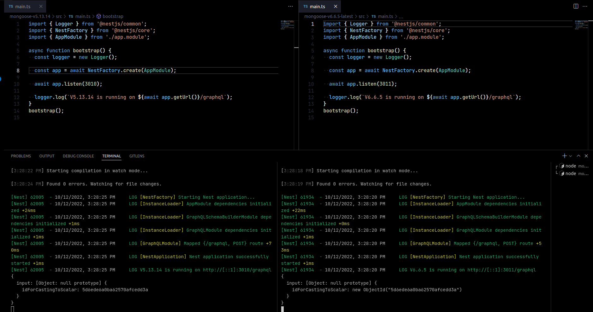
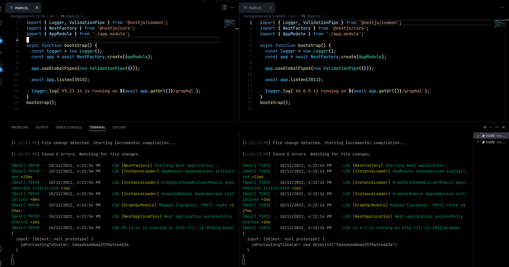
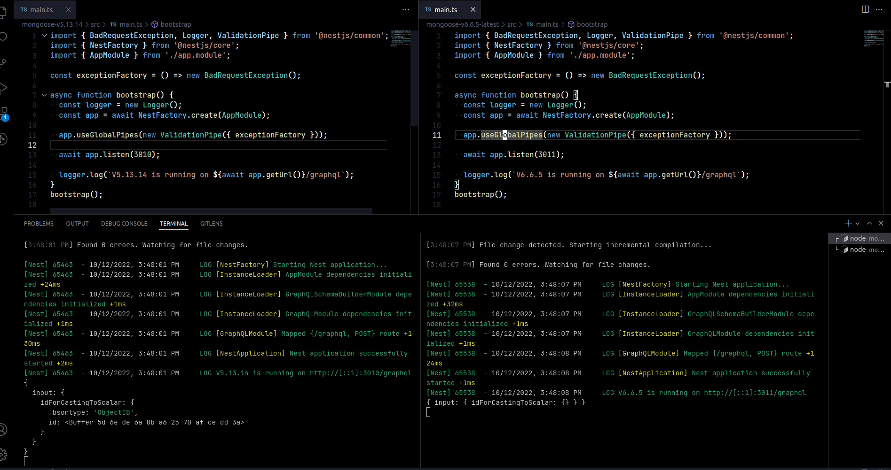
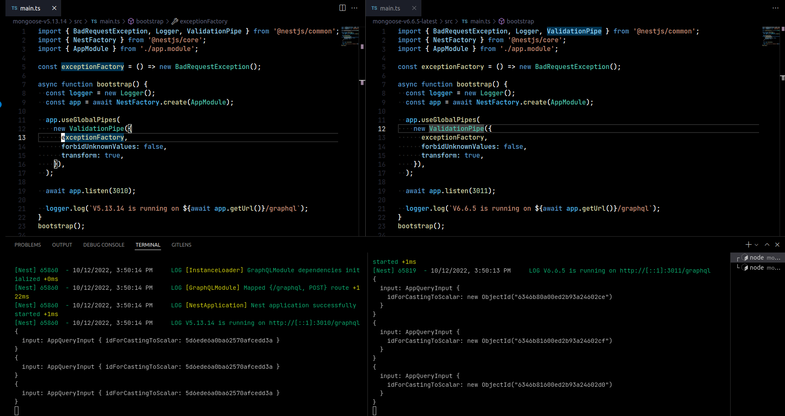

On my previous project i can use gql scalars for casting string to objectId(on previous project i used **5.13.14 version of mongoose**). Now it does not work correctly. The problem appears, when i add validation pipe.

Below are examples of working with/without validation pipe

Example of work without validation pipe:
* 

Example of work with empty validation pipe:
* 

Example of work with not empty validation pipe:
* 

Example of work with transform **true** option in validation pipe:
* 

# I think this is due to this condition in the pipe.

 \
[link to source code of validation pipe](https://github.com/nestjs/nest/blob/master/packages/common/pipes/validation.pipe.ts).

# Gql query example for testing
  - query {
      appQuery (input:{ idForCastingToScalar: "5d6ede6a0ba62570afcedd3a" }) {
      id
    }
  }